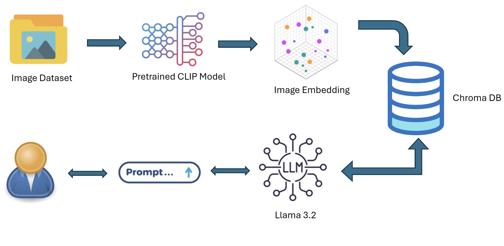

# Interact with Dataset using VML


## Getting started

To make it easy for you to get started with GitLab, here's a list of recommended next steps.

Already a pro? Just edit this README.md and make it your own. Want to make it easy? [Use the template at the bottom](#editing-this-readme)!
# CLIP Image Dataset Chat

An image-dataset exploration proof of concept that combines **OpenAI CLIP**, **ChromaDB**, and **Ollama Llama 3.2**.

Images are converted into normalized CLIP embeddings and stored in a persistent ChromaDB collection. During chat, natural-language queries are embedded with CLIP, matched against the image collection, and passed as structured context to Llama 3.2 for a concise answer.

## Architecture



### Data flow

1. `ingest.py` scans an image directory and extracts image embeddings with `openai/clip-vit-base-patch32`.
2. `vector_store.py` persists embeddings and image metadata in the local `chroma_db/` directory using cosine distance.
3. `chat.py` converts text queries into CLIP text embeddings and retrieves relevant images or dataset statistics.
4. `llm_client.py` sends the retrieved context to Ollama using the `llama3.2:3b` model.

## Features

- Semantic image search with natural-language queries
- Image similarity search with `/similar`
- Potential duplicate detection with `/duplicates`
- Dataset summaries covering folders, formats, resolutions, and file sizes
- Persistent local ChromaDB storage
- CPU and CUDA device selection through PyTorch
- Incremental ingestion that skips images already in the collection

## Requirements

- Python 3.10 or newer
- Ollama installed and running
- Sufficient disk space for the CLIP model and ChromaDB data
- An image directory containing `.jpg`, `.jpeg`, `.png`, `.bmp`, `.tiff`, `.webp`, or `.gif` files

Install Ollama from [ollama.com](https://ollama.com/), then make sure the chat model is available:

```bash
ollama pull llama3.2:3b
```

The first ingestion run downloads the CLIP model from Hugging Face and may take a few minutes.

## Installation

Clone the repository and create a virtual environment:

```bash
git clone <your-repository-url>
cd dataset_poc

python3 -m venv .venv
source .venv/bin/activate  # Windows: .venv\Scripts\activate

python -m pip install --upgrade pip
pip install -r requirements.txt
```

## Usage

Run ingestion first. Replace `path/to/images` with the directory containing your dataset:

```bash
python ingest.py path/to/images
```

This creates or updates the default `image_dataset` collection under `chroma_db/`.

After ingestion completes, start the interactive chat application:

```bash
python chat.py
```

You can use a different collection name in both commands:

```bash
python ingest.py path/to/images my_collection
python chat.py --collection my_collection
```

The chat application also supports optional automatic ingestion, but the recommended workflow is to run `ingest.py` explicitly before `chat.py`:

```bash
python chat.py path/to/images
```

## Chat commands

| Command | Description |
| --- | --- |
| `/help` | Show available commands and examples |
| `/summary` | Ask Llama for a dataset summary |
| `/similar <image_path_or_filename>` | Find images similar to an indexed image |
| `/duplicates` | Find potential near-duplicate images |
| `/reset` | Clear the conversation history |
| `/quit` | Exit the application |

You can also ask questions in natural language, for example:

```text
Find images of cars
What is the distribution of images across folders?
Are there any duplicate images?
What are the most common image formats?
```

## Project structure

```text
.
├── ingest.py                 # Extract CLIP image embeddings and ingest images
├── chat.py                   # Interactive CLI for image-dataset questions
├── llm_client.py             # Ollama Llama 3.2 client and conversation state
├── vector_store.py           # ChromaDB persistence and similarity operations
├── requirements.txt          # Python dependencies
├── Architecture_dragram.png  # System architecture diagram
└── chroma_db/                # Generated local vector database
```

## Notes

- `chroma_db/` is generated locally and should generally not be committed to GitHub for large datasets.
- Image file paths are stored as metadata, so results refer to files available on the machine that performed ingestion.
- The default Ollama model is `llama3.2:3b`; override it with `python chat.py --model <model-name>`.

## License

Add the project license here before publishing, for example MIT, Apache-2.0, or an internal license.
